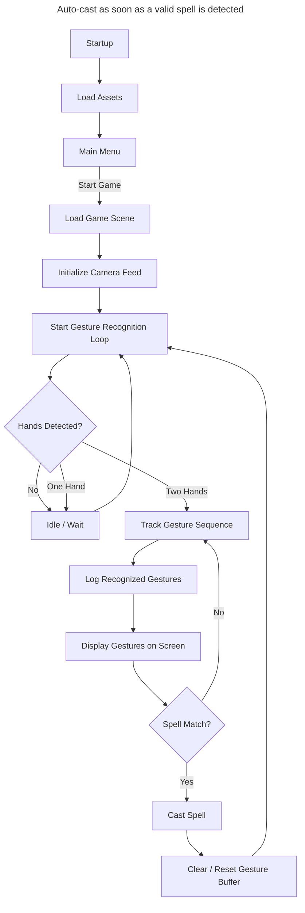

##  1. Auto-cast as soon as a valid spell is detected

* **Pros:**

  * Very fluid and fast — players can “discover” spells by accident.
  * Fits a “chaotic wizard duel” vibe.
* **Cons:**

  * Hard to cancel mistakes.
  * Limits more complex combos (you’d need to filter “partial matches”).
  * Doesn’t mesh well with unlock/paywall design (since players may fire unknown spells).

---

