##  3. Hybrid Approach

* Auto-cast *basic* spells (short combos like “Fireball”) → chaotic discovery.
* Require manual trigger for *advanced* spells (multi-step, or locked).
* This way, you get:

  * Accessibility for beginners.
  * Strategic depth for advanced play.

---

```mermaid
graph TD

    A[Startup] --> B[Load Assets]
    B --> C[Main Menu]
    C -->|Start Game| D[Load Game Scene]

    D --> E[Initialize Camera Feed]
    E --> F[Start Gesture Recognition Loop]

    F --> G{Hands Detected?}
    G -->|No| H[Idle / Wait]
    G -->|One Hand| H
    G -->|Two Hands| I[Track Gesture Sequence]

    H --> F

    I --> J[Log Recognized Gestures]
    J --> K[Display Gestures on Screen]

    K --> L{Spell Match?}
    L -->|No| I
    L -->|Yes| M{Basic or Advanced?}

    M -->|Basic Spell| N[Auto-Cast Immediately]
    N --> O[Cast Spell]
    O --> P[Clear / Reset Gesture Buffer]
    P --> F

    M -->|Advanced Spell| Q{Manual Cast Trigger?}
    Q -->|Hands Leave Screen| R[Submit Sequence]
    Q -->|Double 🤟 or ✊✊| R
    Q -->|Press Spacebar| R
    Q -->|No| I

    R --> O
```

