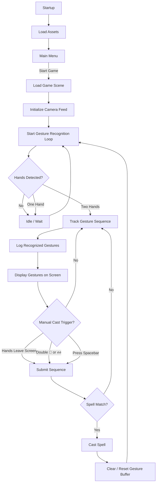
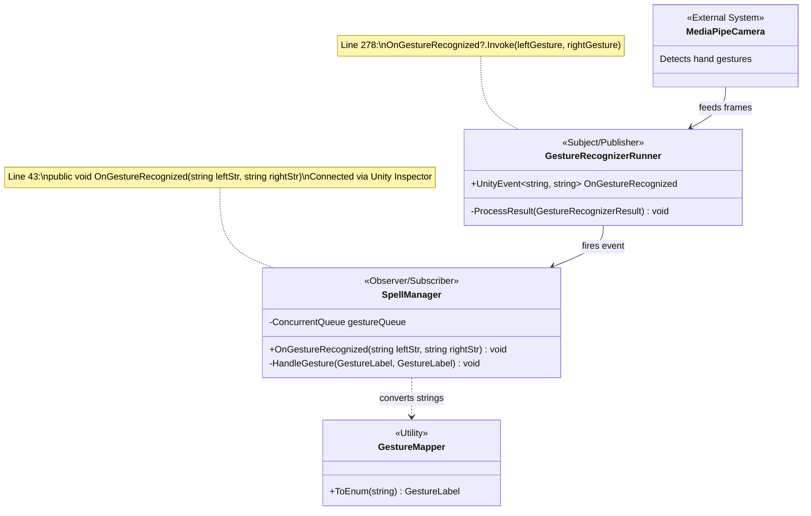
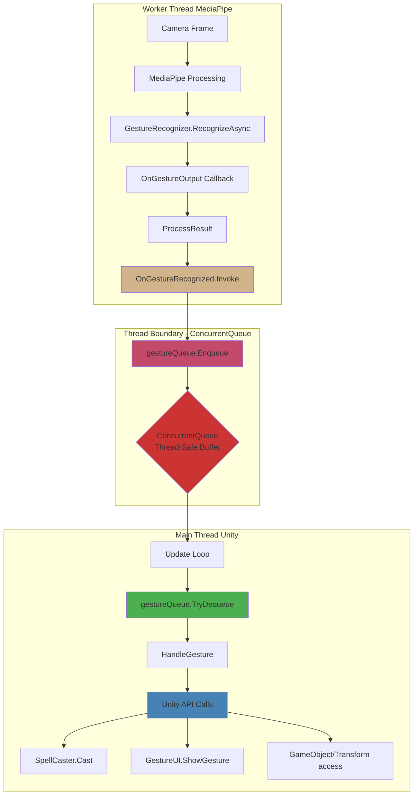

##  2. Manual Cast Trigger (hands off, double sign, or key press)

* **Examples:**

  * Hands leave screen → sequence is submitted.
  * Double “I Love You” 🤟 or double fist ✊✊ = “Cast now.”
  * Press spacebar = “Cast now.”

* **Pros:**

  * Gives players control, lets them cancel.
  * Allows **longer combos** (since recognition waits until explicit cast signal).
  * Fits RPG progression (you “know” which spell you’re trying to cast).

* **Cons:**

  * Slightly slower.
  * Needs clear tutorial/UI feedback (“Ready to cast! Do X to finish”).

---

---

---
