# ninja_wizards_hands

# Spell Arena – Real-Time Multiplayer Gesture-Based Combat

A real-time, peer-to-peer multiplayer extension of the gesture-controlled wizard combat game, built using **Netcode for GameObjects** for state synchronization and **Facepunch.Steamworks** for Steam-based transport and matchmaking.

---

## Problem Domain and Motivation

### The Problem

Building multiplayer functionality into an existing single-player game presents unique challenges around state synchronization, latency compensation, and maintaining responsive gameplay—especially when the core mechanic relies on real-time gesture recognition and spell casting.

### Why It Matters

* Multiplayer combat requires synchronized game state across all clients
* Spell projectiles and effects must be visible and consistent for all players
* Steam integration provides reliable transport, authentication, and friend-based matchmaking
* Peer-to-peer architecture reduces server costs while maintaining competitive gameplay

### The Solution

Wizard Hands Multiplayer extends the single-player gesture-based combat system into a networked experience where players can duel using hand gestures to cast spells. Using Netcode for GameObjects, all critical game state (player positions, health, spell projectiles, animations) is synchronized across clients. Facepunch.Steamworks provides the transport layer, enabling Steam friend invites, lobby creation, and NAT traversal.

---

## Features and Requirements

### Feature 1: Steam Lobby and Matchmaking

**Assigned to:** Individual Project (Solo)

| ID   | User Story                                                              | Acceptance Test                                                              |
| ---- | ----------------------------------------------------------------------- | ---------------------------------------------------------------------------- |
| R1.1 | As a player, I should be able to create a Steam lobby                   | Create lobby → verify lobby appears in Steam overlay                         |
| R1.2 | As a player, I should be able to join a friend's lobby via Steam invite | Send invite → friend joins → verify both players appear in lobby             |
| R1.3 | As a player, I should see connected players in the lobby before starting| Join lobby → verify player list updates in real-time                         |
| R1.4 | As the host, I should be able to start the match when all players ready | All players ready → host starts → verify all clients transition to game      |

---

### Feature 2: Player Synchronization

**Assigned to:** Individual Project (Solo)

| ID   | User Story                                                              | Acceptance Test                                                              |
| ---- | ----------------------------------------------------------------------- | ---------------------------------------------------------------------------- |
| R2.1 | As a player, I should see other players' positions in real-time         | Move character → verify position updates on remote client within 100ms       |
| R2.2 | As a player, I should see other players' animations synchronized        | Cast spell → verify animation plays on all clients                           |
| R2.3 | As a player, I should see other players' health values                  | Take damage → verify health bar updates for all players                      |

---

### Feature 3: Networked Spell Casting

**Assigned to:** Individual Project (Solo)

| ID   | User Story                                                              | Acceptance Test                                                              |
| ---- | ----------------------------------------------------------------------- | ---------------------------------------------------------------------------- |
| R3.1 | As a player, I should see other players' gesture inputs displayed       | Perform gesture → verify gesture indicator visible on remote clients         |
| R3.2 | As a player, I should see spell projectiles from all players            | Cast projectile spell → verify projectile spawns and travels on all clients  |
| R3.3 | As a player, I should see spell effects (shields, auras) on all players | Activate shield → verify shield visual appears on all clients                |

---

### Feature 4: Combat and Damage Synchronization

**Assigned to:** Individual Project (Solo)

| ID   | User Story                                                              | Acceptance Test                                                              |
| ---- | ----------------------------------------------------------------------- | ---------------------------------------------------------------------------- |
| R4.1 | As a player, I should deal damage to remote players with my spells      | Hit remote player with spell → verify damage applied on both clients         |
| R4.2 | As a player, I should receive damage from remote players' spells        | Get hit by spell → verify health decreases and feedback plays                |
| R4.3 | As the system, damage calculation should be authoritative               | Deal damage → verify both clients agree on resulting health value            |

---

### Feature 5: Game State and Win Condition

**Assigned to:** Individual Project (Solo)

| ID   | User Story                                                              | Acceptance Test                                                              |
| ---- | ----------------------------------------------------------------------- | ---------------------------------------------------------------------------- |
| R5.1 | As a player, I should see when an opponent is defeated                  | Reduce opponent health to 0 → verify defeat state shown on all clients       |
| R5.2 | As a player, I should see a win/lose screen at match end                | Match ends → verify correct winner displayed on all clients                  |
| R5.3 | As a player, I should be able to rematch or return to lobby             | Match ends → select rematch → verify both players restart correctly          |

---

### Feature 6: Network Resilience and Disconnect Handling

**Assigned to:** Individual Project (Solo)

| ID   | User Story                                                              | Acceptance Test                                                              |
| ---- | ----------------------------------------------------------------------- | ---------------------------------------------------------------------------- |
| R6.1 | As a player, I should see when an opponent disconnects                  | Disconnect client → verify remaining player sees disconnect notification     |
| R6.2 | As a player, I should be able to return to lobby after opponent leaves  | Opponent disconnects → verify player can return to main menu                 |
| R6.3 | As the system, I should handle host migration if host disconnects       | Host disconnects → verify new host is assigned or graceful session end       |

---

## Data Model and Architecture

### System Architecture

```
┌─────────────────┐                           ┌─────────────────┐
│                 │   Steam P2P Transport     │                 │
│  Unity Client   │◀─────────────────────────▶│  Unity Client   │
│  (Host/Server)  │   Netcode for GameObjects │    (Client)     │
│                 │                           │                 │
└────────┬────────┘                           └────────┬────────┘
         │                                             │
         ▼                                             ▼
┌─────────────────┐                           ┌─────────────────┐
│  Facepunch      │                           │  Facepunch      │
│  Steamworks     │                           │  Steamworks     │
│  (Transport)    │                           │  (Transport)    │
└────────┬────────┘                           └────────┬────────┘
         │                                             │
         └──────────────────┬──────────────────────────┘
                            ▼
                   ┌─────────────────┐
                   │   Steam API     │
                   │ (Relay/NAT/Auth)│
                   └─────────────────┘
```

---

### Core Networked Components

| Component              | Description                                      | Key NetworkVariables / RPCs                    |
| ---------------------- | ------------------------------------------------ | ---------------------------------------------- |
| NetworkedPlayer        | Synchronized player state                        | position, rotation, health, currentGesture     |
| NetworkedSpellCaster   | Handles spell casting across network             | ServerRpc: CastSpell, ClientRpc: OnSpellCast   |
| NetworkedProjectile    | Synchronized spell projectiles                   | NetworkTransform, damage, ownerClientId        |
| NetworkedHealth        | Player health with damage authority              | currentHealth, maxHealth, isDead               |
| LobbyManager           | Steam lobby creation and management              | lobbyId, playerList, readyStates               |
| SteamNetworkTransport  | Facepunch.Steamworks transport layer             | SteamId, connection state                      |

---

### Network Architecture Decisions

| Decision                | Choice                    | Rationale                                              |
| ----------------------- | ------------------------- | ------------------------------------------------------ |
| Network Topology        | Host-Client (P2P)         | No dedicated server needed; Steam handles NAT          |
| State Synchronization   | Server-Authoritative      | Host validates damage and game state                   |
| Transport Layer         | Facepunch.Steamworks      | Steam relay, friend integration, no port forwarding    |
| Projectile Spawning     | Server-spawned            | Prevents duplicate projectiles and cheating            |
| Health/Damage           | Server-authoritative      | Host calculates and broadcasts damage results          |

---

## Tests

### Test Strategy

Each requirement includes a direct acceptance test. Testing will include:

* **Unit Tests**: NetworkVariable serialization, damage calculation logic
* **Integration Tests**: Lobby creation/joining, player spawning, RPC delivery
* **Acceptance Tests**: Full multiplayer matches with gesture input on both clients

### Burndown Metrics

| Metric       | Count |
| ------------ | ----- |
| Features     | 6     |
| Requirements | 19    |
| Tests        | 19    |

---

## Developer Information

| Name          | Role           |
| ------------- | -------------- |
| Joe Ampfer | Developer |

---

## Links

| Resource              | Link                                     |
| --------------------- | ---------------------------------------- |
| GitHub Repository     | [wizards](https://github.com/jp-loran/wizards) |
| Project Documentation | [docs/](./docs/)                         |
| Source Code           | [code/](./code/)                         |
| Demo Video            | *TBD*                                    |

---

README START


README END
--------------
This is just documentation for the game.

Download a demo for Windows and try it out:  https://drive.google.com/file/d/1dMynKtngsOCwr-KwRBChzfMUlerCgxel/view?usp=drive_link


---

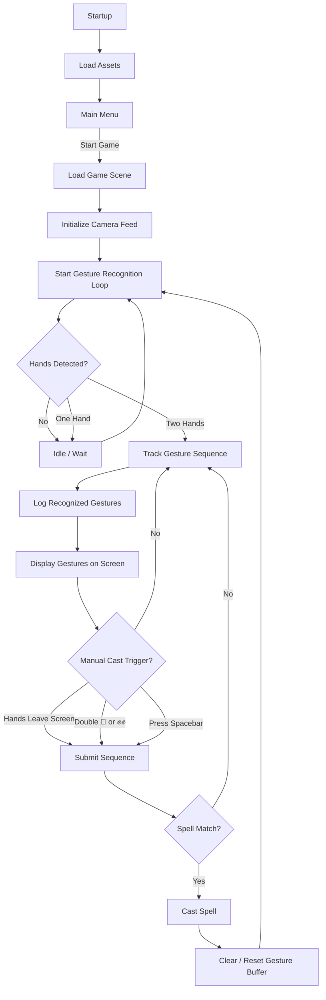
```mermaid
graph TD

    A[Startup] --> B[Load Assets]
    B --> C[Main Menu]
    C -->|Start Game| D[Load Game Scene]

    D --> E[Initialize Camera Feed]
    E --> F[Start Gesture Recognition Loop]

    F --> G{Hands Detected?}
    G -->|No| H[Idle / Wait]
    G -->|One Hand| H
    G -->|Two Hands| I[Track Gesture Sequence]

    H --> F

    I --> J[Log Recognized Gestures]
    J --> K[Display Gestures on Screen]
    K --> L{Manual Cast Trigger?}

    L -->|Hands Leave Screen| M[Submit Sequence]
    L -->|Double 🤟 or ✊✊| M
    L -->|Press Spacebar| M
    L -->|No| I

    M --> N{Spell Match?}
    N -->|No| I
    N -->|Yes| O[Cast Spell]

    O --> P[Clear / Reset Gesture Buffer]
    P --> F
```
---

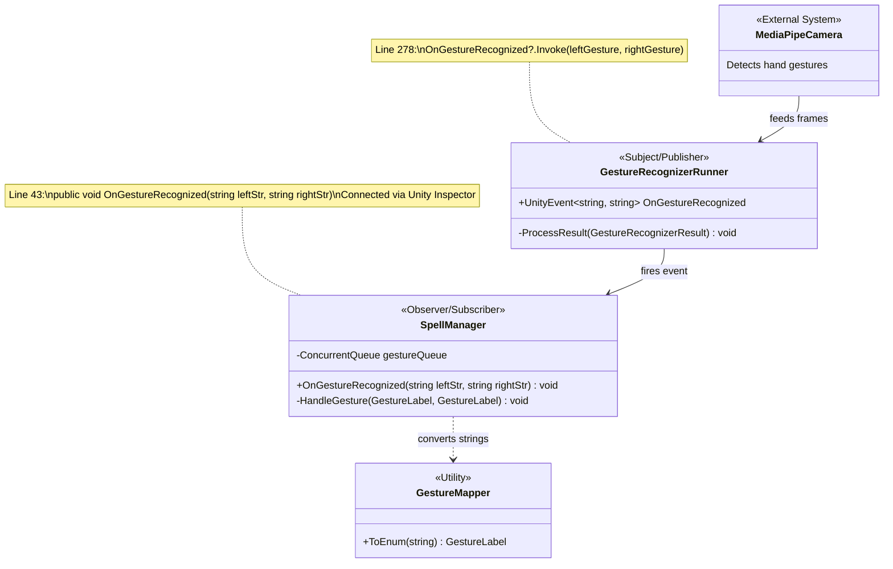
```mermaid
classDiagram

    class GestureRecognizerRunner {
        <<Subject/Publisher>>
        +UnityEvent~string, string~ OnGestureRecognized
        -ProcessResult(GestureRecognizerResult) void
    }
    
    class SpellManager {
        <<Observer/Subscriber>>
        +OnGestureRecognized(string leftStr, string rightStr) void
        -HandleGesture(GestureLabel, GestureLabel) void
        -ConcurrentQueue gestureQueue
    }
    
    class MediaPipeCamera {
        <<External System>>
        Detects hand gestures
    }
    
    class GestureMapper {
        <<Utility>>
        +ToEnum(string) GestureLabel
    }
    
    MediaPipeCamera --> GestureRecognizerRunner : feeds frames
    GestureRecognizerRunner --> SpellManager : fires event
    SpellManager ..> GestureMapper : converts strings
    
    note for GestureRecognizerRunner "Line 278:\nOnGestureRecognized?.Invoke(leftGesture, rightGesture)"
    
    note for SpellManager "Line 43:\npublic void OnGestureRecognized(string leftStr, string rightStr)\nConnected via Unity Inspector"

```

---
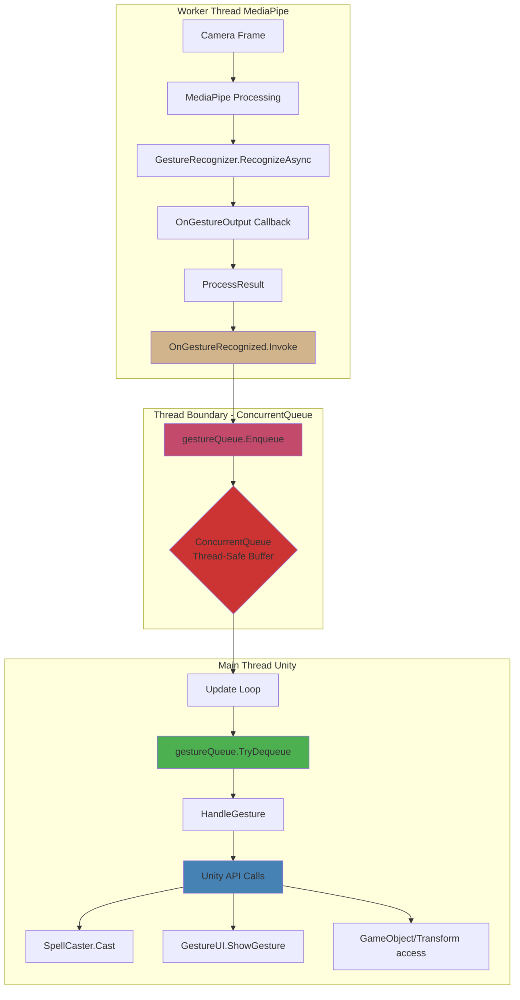
```mermaid
graph TB
    subgraph "Worker Thread MediaPipe"
        A[Camera Frame] --> B[MediaPipe Processing]
        B --> C[GestureRecognizer.RecognizeAsync]
        C --> D[OnGestureOutput Callback]
        D --> E[ProcessResult]
        E --> F[OnGestureRecognized.Invoke]
    end
    
    subgraph "Thread Boundary - ConcurrentQueue"
        F --> G[gestureQueue.Enqueue]
        G --> H{ConcurrentQueue<br/>Thread-Safe Buffer}
    end
    
    subgraph "Main Thread Unity"
        H --> I[Update Loop]
        I --> J[gestureQueue.TryDequeue]
        J --> K[HandleGesture]
        K --> L[Unity API Calls]
        L --> M[SpellCaster.Cast]
        L --> N[GestureUI.ShowGesture]
        L --> O[GameObject/Transform access]
    end
    
    style G fill:#C34A6B
    style H fill:#CC3333
    style J fill:#4CAF50
    style F fill:#D2B48C
    style L fill:#4682B4
```

---

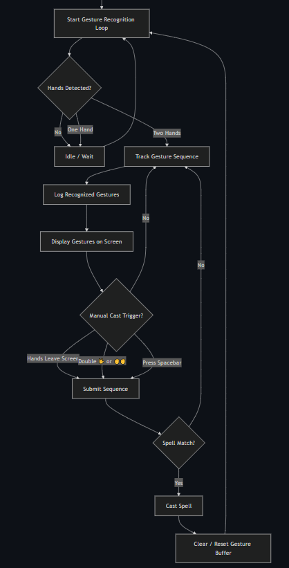

---

1. Core Spell System (Strategy Pattern)
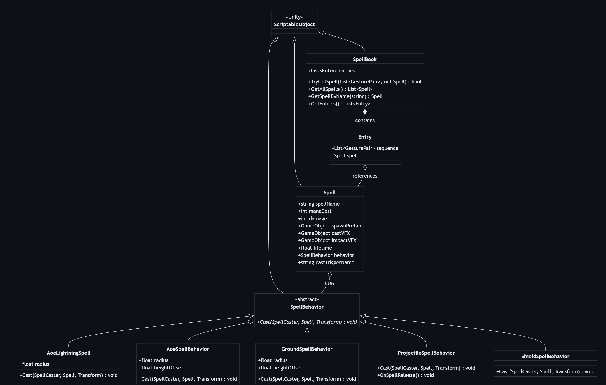

---

2. Spell Casting System
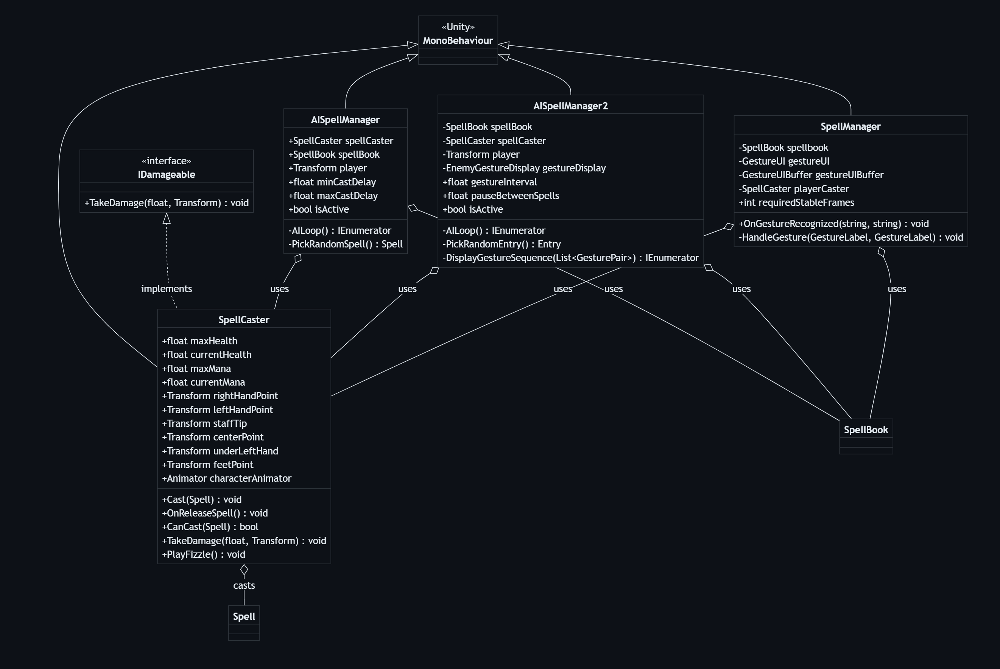

---

3. Gesture Recognition System
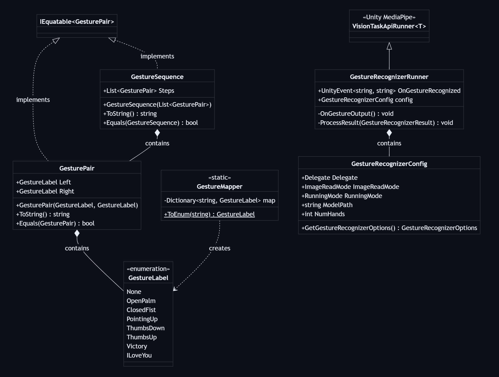

---

4. UI Components
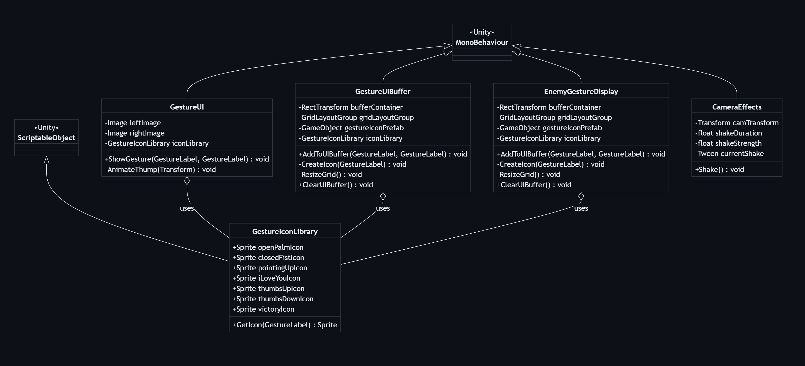

---

5. Combat & Projectile System
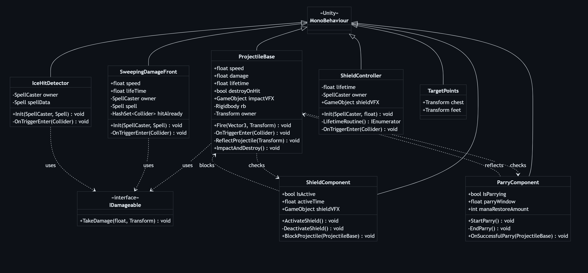

---

6. Overall System Architecture
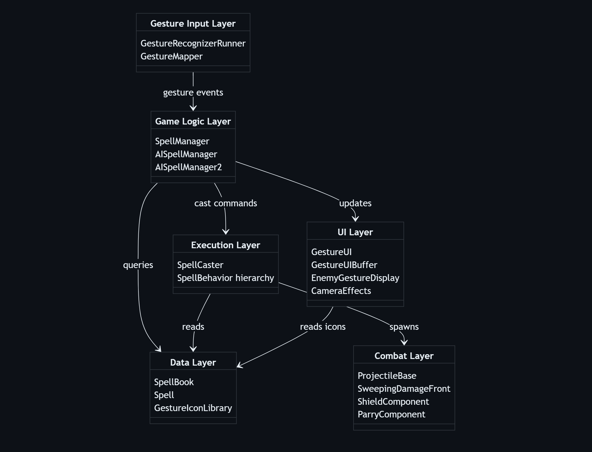

---

## **Key Patterns**

### **Strategy Pattern ⭐ (Core Pattern):**


Location: Spell.cs holds a SpellBehavior reference, and different behaviors implement different casting logic.
Benefits:
- Easy to add new spell types without modifying existing code
- Each spell behavior is isolated and testable
- Runtime behavior switching possible

---

### **Observer Pattern:**


---

#### Detailed observer flow
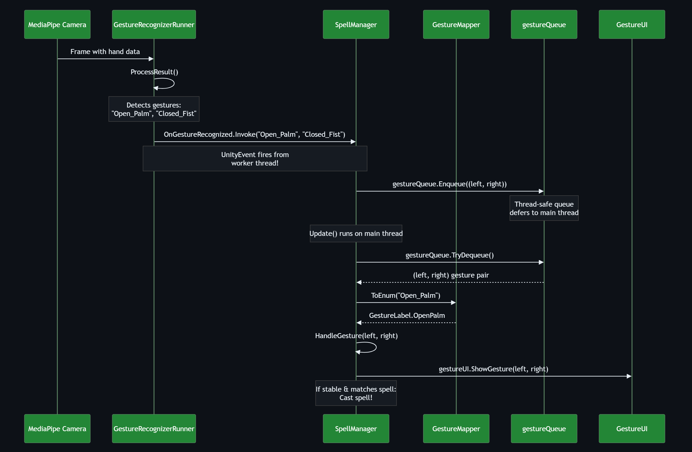

---

### **Facade Pattern**
`SpellCaster` acts as a facade, providing a simplified interface to the complex spell-casting subsystem:


---

### **Adapter Pattern**
GestureMapper adapts MediaPipe strings to internal enums.


---

### **Flyweight Pattern**
ScriptableObjects share data across multiple instances.


---

### **Component Pattern (Unity):**
Multiple components attached to same GameObject communicate via GetComponent<T>():
- SpellCaster ↔ Animator
- SpellCaster ↔ ShieldComponent
- ProjectileBase ↔ Rigidbody
- AISpellManager2 requires SpellCaster

### **Manager/Service Pattern:**
- **SpellManager** orchestrates gesture input → spell casting
- **AISpellManager/AISpellManager2** orchestrate AI spell casting
- **CameraEffects** provides camera shake service

---

This architecture follows a clean separation between:
1. **Data** (Spell, SpellBook as ScriptableObjects)
2. **Behavior** (SpellBehavior strategy pattern)
3. **Execution** (SpellCaster, AISpellManager)
4. **Input** (SpellManager, GestureRecognizerRunner)
5. **UI** (GestureUI, GestureUIBuffer, EnemyGestureDisplay)

---


---