```mermaid
graph TD

    A[Startup] --> B[Load Assets]
    B --> C[Main Menu]
    C -->|Start Game| D[Load Game Scene]

    D --> E[Initialize Camera Feed]
    E --> F[Start Gesture Recognition Loop]

    F --> G{Hands Detected?}
    G -->|No| H[Idle / Wait]
    G -->|One Hand| H
    G -->|Two Hands| I[Track Gesture Sequence]

    H --> F

    I --> J[Log Recognized Gestures]
    J --> K[Display Gestures on Screen]
    K --> L{Manual Cast Trigger?}

    L -->|Hands Leave Screen| M[Submit Sequence]
    L -->|Double 🤟 or ✊✊| M
    L -->|Press Spacebar| M
    L -->|No| I

    M --> N{Spell Match?}
    N -->|No| I
    N -->|Yes| O[Cast Spell]

    O --> P[Clear / Reset Gesture Buffer]
    P --> F
```

# ninja_wizards_hands

This is just documentation for the game.

Download a demo for Windows and try it out:  https://drive.google.com/file/d/1dMynKtngsOCwr-KwRBChzfMUlerCgxel/view?usp=drive_link

---

---

---

---

---

1. Core Spell System (Strategy Pattern)

---

2. Spell Casting System

---

3. Gesture Recognition System

---

4. UI Components

---

5. Combat & Projectile System

---

6. Overall System Architecture

---

## **Key Patterns**

### **Strategy Pattern ⭐ (Core Pattern):**

Location: Spell.cs holds a SpellBehavior reference, and different behaviors implement different casting logic.
Benefits:
- Easy to add new spell types without modifying existing code
- Each spell behavior is isolated and testable
- Runtime behavior switching possible

---

### **Observer Pattern:**

---

#### Detailed observer flow

---

### **Facade Pattern**
`SpellCaster` acts as a facade, providing a simplified interface to the complex spell-casting subsystem:

---

### **Adapter Pattern**
GestureMapper adapts MediaPipe strings to internal enums.

---

### **Flyweight Pattern**
ScriptableObjects share data across multiple instances.

---

### **Component Pattern (Unity):**
Multiple components attached to same GameObject communicate via GetComponent<T>():
- SpellCaster ↔ Animator
- SpellCaster ↔ ShieldComponent
- ProjectileBase ↔ Rigidbody
- AISpellManager2 requires SpellCaster

### **Manager/Service Pattern:**
- **SpellManager** orchestrates gesture input → spell casting
- **AISpellManager/AISpellManager2** orchestrate AI spell casting
- **CameraEffects** provides camera shake service

---

This architecture follows a clean separation between:
1. **Data** (Spell, SpellBook as ScriptableObjects)
2. **Behavior** (SpellBehavior strategy pattern)
3. **Execution** (SpellCaster, AISpellManager)
4. **Input** (SpellManager, GestureRecognizerRunner)
5. **UI** (GestureUI, GestureUIBuffer, EnemyGestureDisplay)

---

---