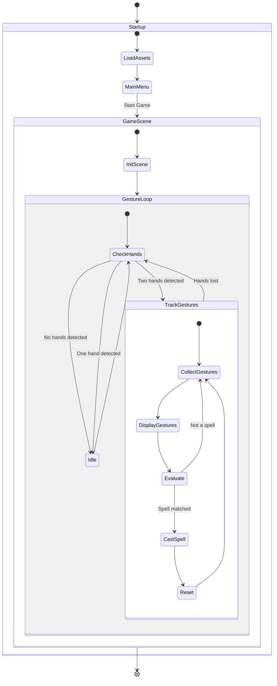

```mermaid
stateDiagram-v2
    [*] --> Startup

    state Startup {
        [*] --> LoadAssets
        LoadAssets --> MainMenu
        MainMenu --> GameScene: Start Game
    }

    state GameScene {
        [*] --> InitScene
        InitScene --> GestureLoop

        state GestureLoop {
            [*] --> CheckHands

            CheckHands --> Idle: No hands detected
            CheckHands --> Idle: One hand detected
            CheckHands --> TrackGestures: Two hands detected

            Idle --> CheckHands

            state TrackGestures {
                [*] --> CollectGestures
                CollectGestures --> DisplayGestures
                DisplayGestures --> Evaluate
                Evaluate --> CollectGestures: Not a spell
                Evaluate --> CastSpell: Spell matched
                CastSpell --> Reset
                Reset --> CollectGestures
            }

            TrackGestures --> CheckHands: Hands lost
        }
    }

    GameScene --> [*]

```
