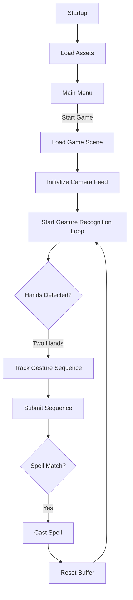
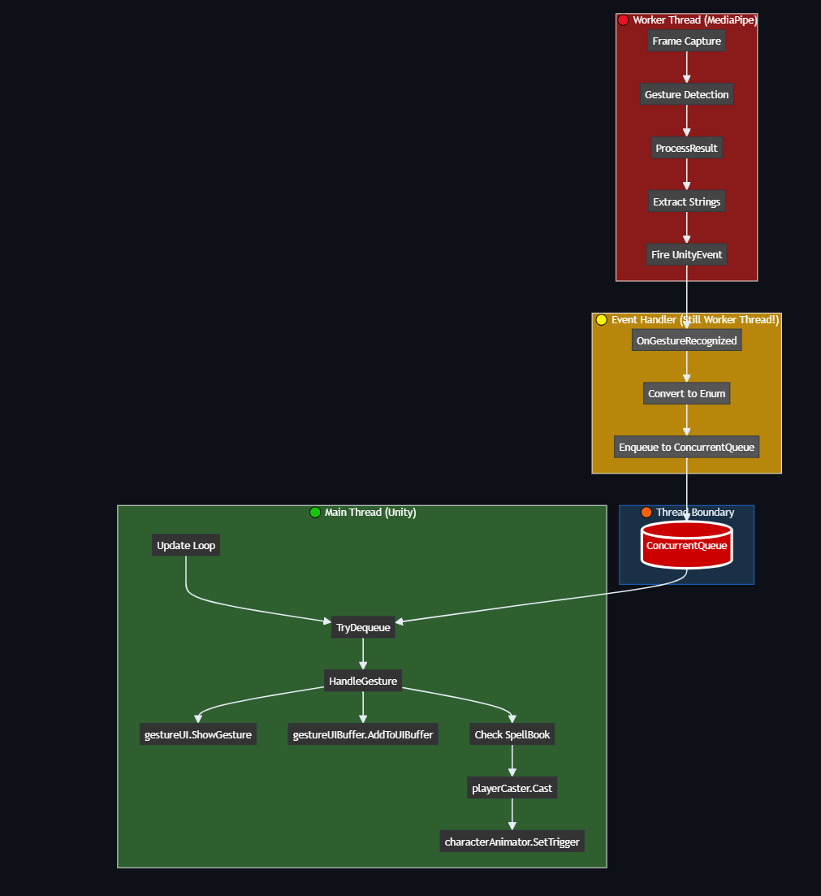
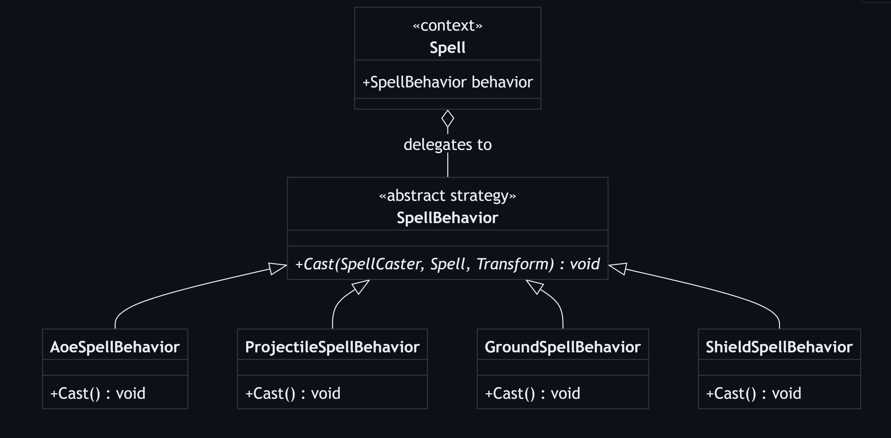
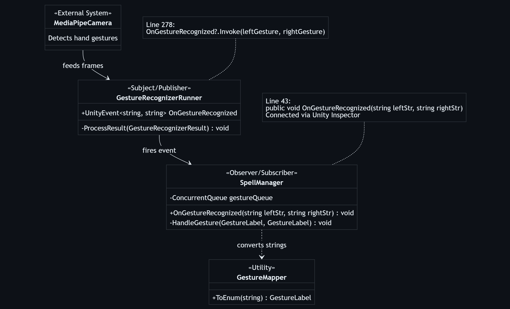
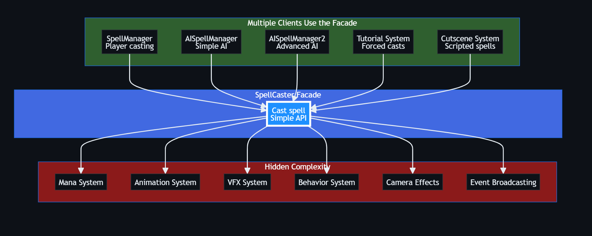
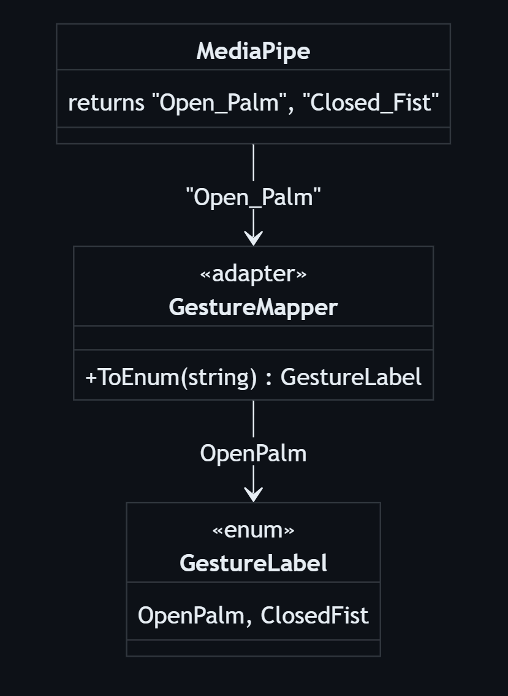
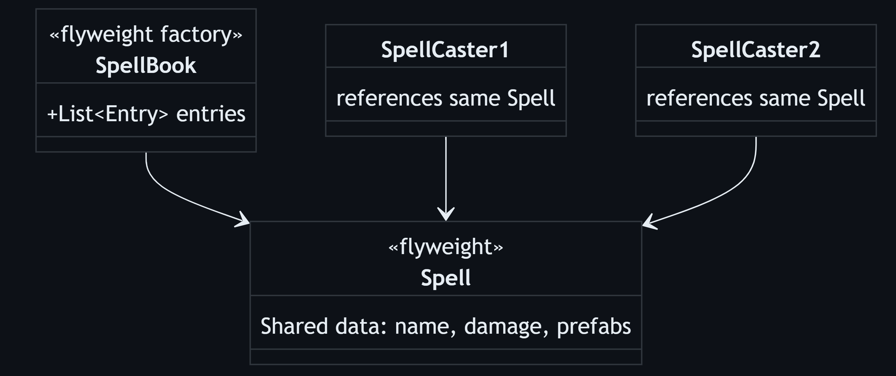

<!-- _class: lead -->
<!-- _backgroundColor: #16213e -->

# 🧙‍♂️ Spell Arena

## Real-Time Multiplayer Gesture-Based Combat

**Project Plan Presentation**

Joe Ampfer | ASE 330 Human Computer Interaction

---

# Agenda

1. **Problem Domain & Motivation**
2. **Features & Requirements**
3. **System Architecture**
4. **Core Networked Components**
5. **Design Patterns**
6. **Testing Strategy**
7. **Demo & Links**

---

# Problem Domain

## The Challenge

Building **multiplayer functionality** into an existing single-player game presents unique challenges:

- 🔄 **State Synchronization** across all clients
- ⏱️ **Latency Compensation** for responsive gameplay
- 🎯 **Real-time Gesture Recognition** with spell casting
- 🌐 **Network Reliability** and disconnect handling

---

# Why It Matters

| Challenge | Impact |
|-----------|--------|
| Synchronized game state | All players see the same reality |
| Consistent spell projectiles | Fair competitive gameplay |
| Steam integration | Reliable transport & authentication |
| P2P architecture | Reduced server costs |

---

# The Solution

## Wizard Hands Multiplayer

Extends the single-player gesture-based combat into a **networked experience**:

- **Netcode for GameObjects** - State synchronization
- **Facepunch.Steamworks** - Steam transport layer
- **Peer-to-Peer** - Friend invites, lobby creation, NAT traversal

Players duel using **hand gestures** to cast spells! 🪄

---

# Feature 1: Steam Lobby & Matchmaking

| ID | User Story | Acceptance Test |
|----|------------|-----------------|
| R1.1 | Create a Steam lobby | Verify lobby appears in Steam overlay |
| R1.2 | Join friend's lobby via invite | Both players appear in lobby |
| R1.3 | See connected players before start | Player list updates real-time |
| R1.4 | Host starts match when ready | All clients transition to game |

---

# Feature 2: Player Synchronization

| ID | User Story | Acceptance Test |
|----|------------|-----------------|
| R2.1 | See other players' positions | Position updates within 100ms |
| R2.2 | See synchronized animations | Animation plays on all clients |
| R2.3 | See other players' health | Health bar updates for all |

---

# Feature 3: Networked Spell Casting

| ID | User Story | Acceptance Test |
|----|------------|-----------------|
| R3.1 | See gesture inputs displayed | Gesture visible on remote clients |
| R3.2 | See spell projectiles | Projectile spawns on all clients |
| R3.3 | See spell effects (shields, auras) | Shield visual on all clients |

---

# Feature 4: Combat & Damage Sync

| ID | User Story | Acceptance Test |
|----|------------|-----------------|
| R4.1 | Deal damage to remote players | Damage applied on both clients |
| R4.2 | Receive damage from remote spells | Health decreases with feedback |
| R4.3 | Authoritative damage calculation | Both clients agree on health |

---

# Feature 5: Game State & Win Condition

| ID | User Story | Acceptance Test |
|----|------------|-----------------|
| R5.1 | See when opponent is defeated | Defeat state shown on all clients |
| R5.2 | See win/lose screen at match end | Correct winner displayed |
| R5.3 | Rematch or return to lobby | Both players restart correctly |

---

# Feature 6: Network Resilience

| ID | User Story | Acceptance Test |
|----|------------|-----------------|
| R6.1 | See when opponent disconnects | Disconnect notification shown |
| R6.2 | Return to lobby after disconnect | Player can return to menu |
| R6.3 | Handle host migration | New host assigned gracefully |

---

# System Architecture

```
┌─────────────────┐                           ┌─────────────────┐
│                 │   Steam P2P Transport     │                 │
│  Unity Client   │◀─────────────────────────▶│  Unity Client   │
│  (Host/Server)  │   Netcode for GameObjects │    (Client)     │
│                 │                           │                 │
└────────┬────────┘                           └────────┬────────┘
         │                                             │
         ▼                                             ▼
┌─────────────────┐                           ┌─────────────────┐
│  Facepunch      │                           │  Facepunch      │
│  Steamworks     │                           │  Steamworks     │
│  (Transport)    │                           │  (Transport)    │
└────────┬────────┘                           └────────┬────────┘
         │                                             │
         └──────────────────┬──────────────────────────┘
                            ▼
                   ┌─────────────────┐
                   │   Steam API     │
                   │ (Relay/NAT/Auth)│
                   └─────────────────┘
```

---

# Core Networked Components

| Component | Description | Key NetworkVariables/RPCs |
|-----------|-------------|---------------------------|
| NetworkedPlayer | Synchronized player state | position, rotation, health |
| NetworkedSpellCaster | Spell casting across network | ServerRpc: CastSpell |
| NetworkedProjectile | Synchronized projectiles | NetworkTransform, damage |
| NetworkedHealth | Player health with authority | currentHealth, isDead |
| LobbyManager | Steam lobby management | lobbyId, playerList |
| SteamNetworkTransport | Facepunch transport layer | SteamId, connection |

---

# Network Architecture Decisions

| Decision | Choice | Rationale |
|----------|--------|-----------|
| Network Topology | Host-Client (P2P) | No dedicated server; Steam handles NAT |
| State Sync | Server-Authoritative | Host validates damage and state |
| Transport | Facepunch.Steamworks | Steam relay, friend integration |
| Projectile Spawning | Server-spawned | Prevents duplicates & cheating |
| Health/Damage | Server-authoritative | Host calculates & broadcasts |

---

# Game Flow



---

# Threading Model



- **Worker Thread**: MediaPipe processing
- **Thread Boundary**: ConcurrentQueue buffer
- **Main Thread**: Unity API calls

---

# Design Pattern: Strategy ⭐



**Location**: `Spell.cs` holds SpellBehavior reference

**Benefits**:
- Add new spell types easily
- Isolated & testable behaviors
- Runtime switching possible

---

# Design Pattern: Observer



**GestureRecognizerRunner** publishes gesture events

**SpellManager** subscribes and handles gestures

---

# Design Pattern: Facade



**SpellCaster** provides simplified interface to complex spell-casting subsystem

---

# Design Pattern: Adapter



**GestureMapper** adapts MediaPipe strings to internal enums

---

# Design Pattern: Flyweight



**ScriptableObjects** share data across multiple instances

---

# Additional Patterns

### Component Pattern (Unity)
- SpellCaster ↔ Animator
- SpellCaster ↔ ShieldComponent
- ProjectileBase ↔ Rigidbody

### Manager/Service Pattern
- **SpellManager** - gesture input → spell casting
- **AISpellManager** - AI spell orchestration
- **CameraEffects** - camera shake service

---

# Clean Architecture Separation

| Layer | Components |
|-------|------------|
| **Data** | Spell, SpellBook (ScriptableObjects) |
| **Behavior** | SpellBehavior (Strategy Pattern) |
| **Execution** | SpellCaster, AISpellManager |
| **Input** | SpellManager, GestureRecognizerRunner |
| **UI** | GestureUI, GestureUIBuffer, EnemyGestureDisplay |

---

# Test Strategy

### Testing Approach

| Type | Coverage |
|------|----------|
| **Unit Tests** | NetworkVariable serialization, damage calculation |
| **Integration Tests** | Lobby creation/joining, player spawning, RPC delivery |
| **Acceptance Tests** | Full multiplayer matches with gesture input |

---

# Burndown Metrics

| Metric | Count |
|--------|-------|
| Features | **6** |
| Requirements | **19** |
| Tests | **19** |

All requirements have direct acceptance tests defined ✅

---

# Project Links

| Resource | Link |
|----------|------|
| GitHub Repository | [github.com/jp-loran/wizards](https://github.com/jp-loran/wizards) |
| Source Code | `./code/` |
| Documentation | `./docs/` |
| Demo Download | [Google Drive](https://drive.google.com/file/d/1dMynKtngsOCwr-KwRBChzfMUlerCgxel/view) |

---

# Developer

| Name | Role |
|------|------|
| **Joe Ampfer** | Developer |

**Course**: ASE 330 - Human Computer Interaction

---

<!-- _class: lead -->
<!-- _backgroundColor: #16213e -->

# 🎮 Demo Time!

## Questions?

**Try the demo**: [Download for Windows](https://drive.google.com/file/d/1dMynKtngsOCwr-KwRBChzfMUlerCgxel/view)

---

<!-- _class: lead -->
<!-- _backgroundColor: #0f3460 -->

# Thank You! 🧙‍♂️

**Spell Arena** - Real-Time Multiplayer Gesture-Based Combat

Joe Ampfer | ASE 330
