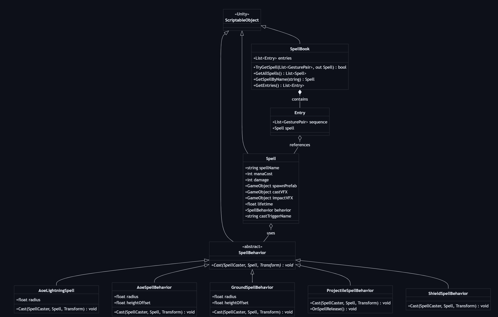
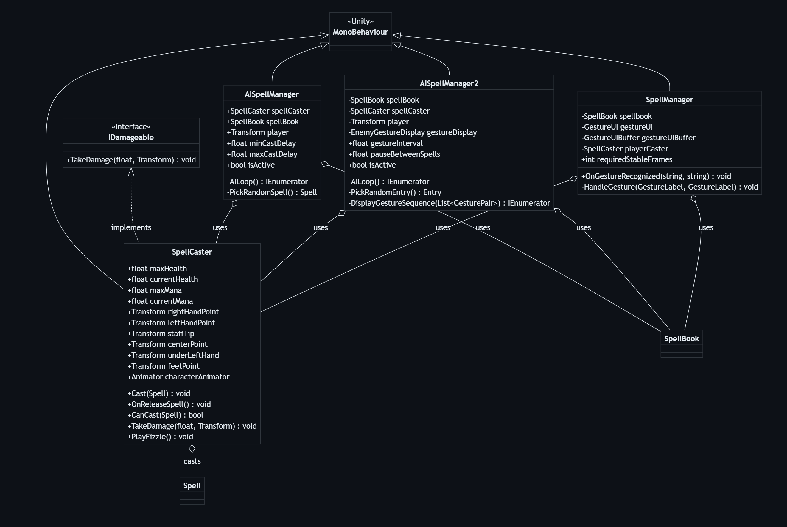
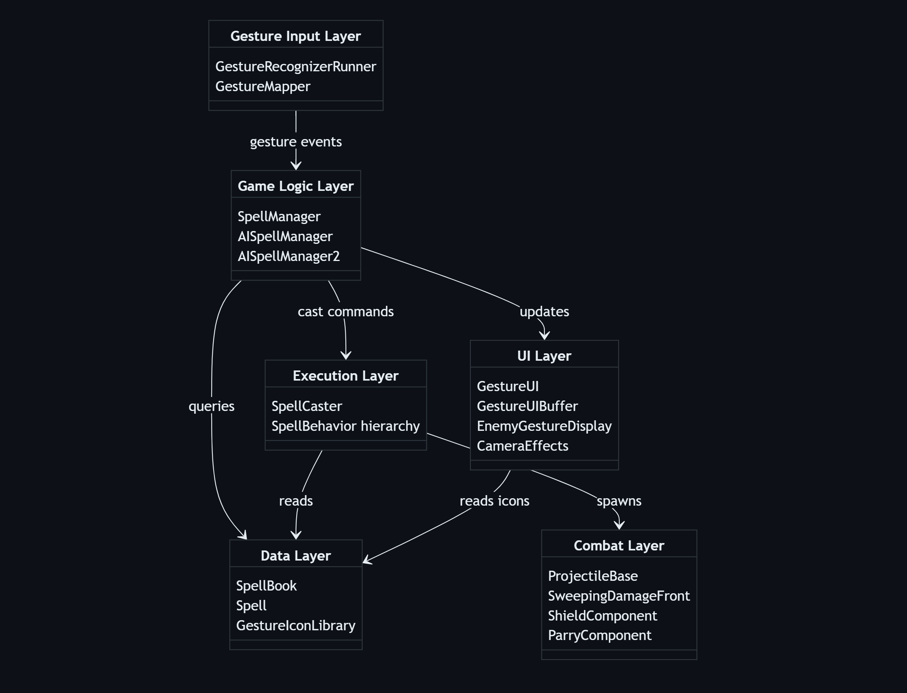
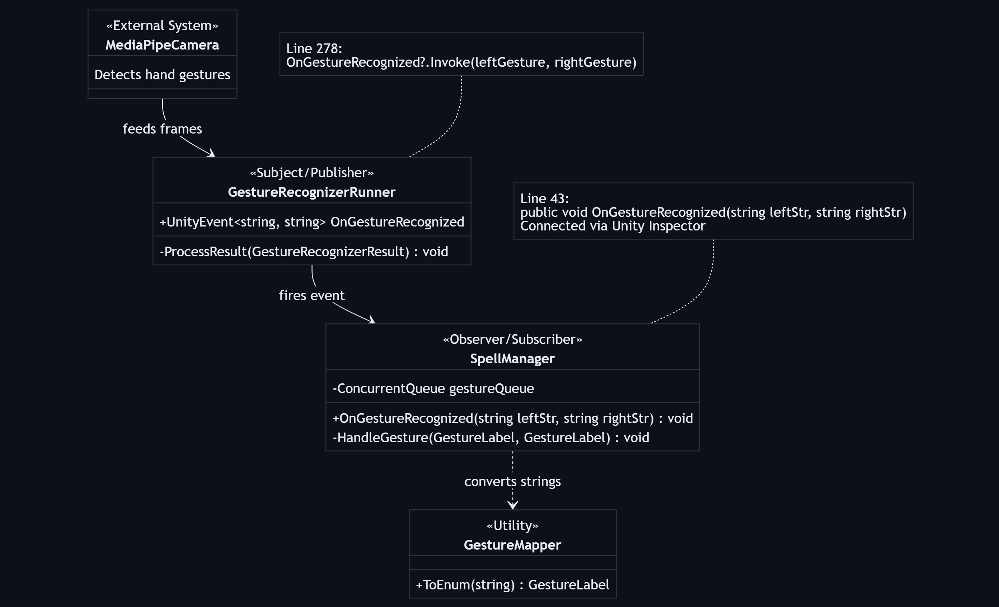
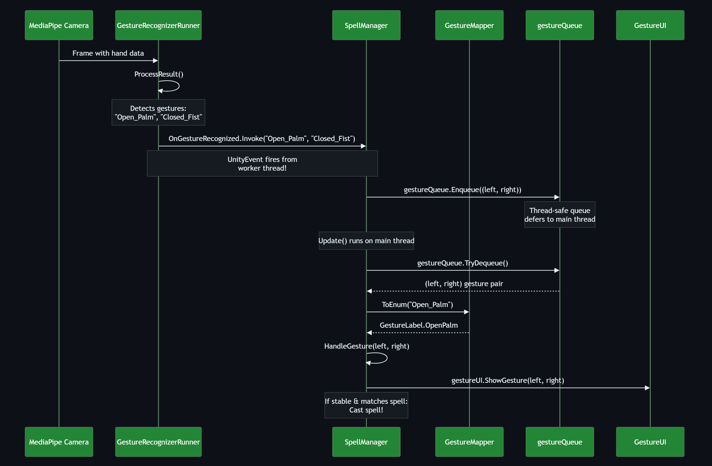
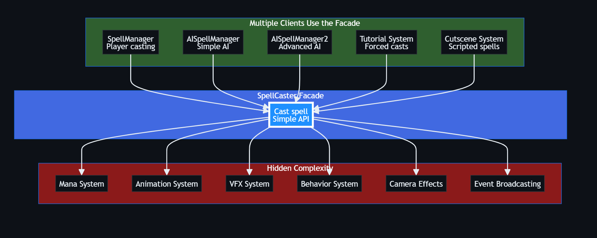
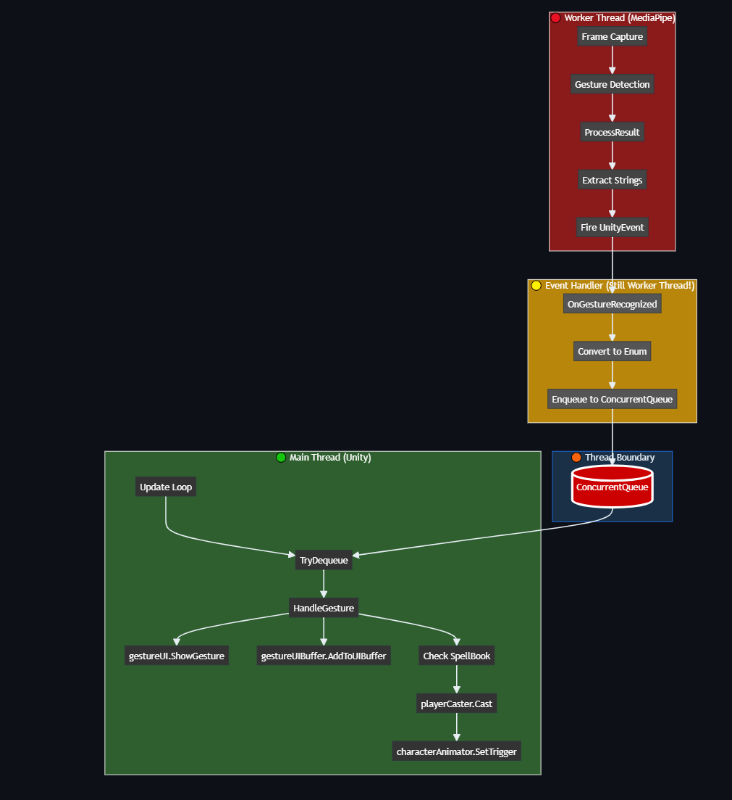

# Wizards Game
## Individual Project Report

**Evaluating AI Performance on Medical Licensing Exams**

---

What?

A Unity-based 1v1 combat game where players use hand gestures to cast spells, block, or counter enemy moves.
It combines gesture recognition, animation, and strategy — a magical rock-paper-scissors brought to life.

---

Why? 

Games like War of Wizards require a VR headset
- Many people don’t have one, but desire a similar experience
- VR Headsets are expensive
A novel way to play a game
New skill mastery

---

1. **Sprint 1 Demo**
   - Show working features from Sprint 1

---

---

1. Core Spell System (Strategy Pattern)

---

2. Spell Casting System

---

3. Gesture Recognition System

---

4. UI Components

---

5. Combat & Projectile System

---

6. Overall System Architecture

---

## **Key Patterns**

### **Strategy Pattern ⭐ (Core Pattern):**

Location: Spell.cs holds a SpellBehavior reference, and different behaviors implement different casting logic.
Benefits:
- Easy to add new spell types without modifying existing code
- Each spell behavior is isolated and testable
- Runtime behavior switching possible

---

### **Observer Pattern:**

---

#### Detailed observer flow

---

### **Facade Pattern**
`SpellCaster` acts as a facade, providing a simplified interface to the complex spell-casting subsystem:

---

### **Adapter Pattern**
GestureMapper adapts MediaPipe strings to internal enums.

---

### **Flyweight Pattern**
ScriptableObjects share data across multiple instances.

---

### **Component Pattern (Unity):**
Multiple components attached to same GameObject communicate via GetComponent<T>():
- SpellCaster ↔ Animator
- SpellCaster ↔ ShieldComponent
- ProjectileBase ↔ Rigidbody
- AISpellManager2 requires SpellCaster

### **Manager/Service Pattern:**
- **SpellManager** orchestrates gesture input → spell casting
- **AISpellManager/AISpellManager2** orchestrate AI spell casting
- **CameraEffects** provides camera shake service

---

This architecture follows a clean separation between:
1. **Data** (Spell, SpellBook as ScriptableObjects)
2. **Behavior** (SpellBehavior strategy pattern)
3. **Execution** (SpellCaster, AISpellManager)
4. **Input** (SpellManager, GestureRecognizerRunner)
5. **UI** (GestureUI, GestureUIBuffer, EnemyGestureDisplay)

---

2. **Sprint 1 Retrospective**
   - Project metrics: LoC, # of features, # of requirements, and burndown rate
   - What Went Wrong/Well with Analysis & Improvement Plan

---

Project Metrics

- Total individual Lines of Code (LoC): ___2,865___ (195,419 in whole project)
- Number of individual features completed: ___4___
- Number of individual requirements completed: ___15___
- Individual burndown rate (%): ___100___

---

### What Went Wrong (Individual Level):
- **Thread Safety** - MediaPipe Gesture Recognizer runs on worker thread, so no side effects can happen in the game because of it.

---

---

### What Went Well (Individual Level):
- **Learned Unity basics** - More familiar with a system I have never used
- **Working prototype**  
- **Integrated Unity Store Assets**

---

### Analysis & Improvement Plan (Individual Level):

**1. Health and Mana System**
- Implement visual health and mana bars for both player and AI opponent
- Integrate mana costs with spell casting (prevent casting when insufficient mana)
- Add damage feedback and mana regeneration over time
- Display numerical values alongside bars for clarity

**2. Combat Adjustments**
- Balance spell damage values and casting cooldowns
- Fix collision detection issues with projectiles
- Improve AI spell timing and decision-making
- Adjust game pace for better player experience

---

3. **Sprint 2 Goals**
   - What will you accomplish in Sprint 2
   - Project metrics: # of features and # of requirements
   - Updated timeline and milestones

---

What will you accomplish in Sprint 2

- **Health & Mana System** - Implement visual bars, damage feedback, and resource management
- **Combat Balance** - Adjust spell damage, cooldowns, and AI difficulty for better gameplay
- **Additional Spells** - Expand spell variety with new attack and defensive spell types
- **Polish & Effects** - Add particle effects, sound effects, and UI improvements

---

Project metrics: # of features and # of requirements

- Number of individual features planned: ___4___
- Number of individual requirements planned: ___12___

---

### Updated Individual Timeline and Milestones:

Make your individual progress plan

- **Week 1:** Health & Mana System Implementation
  - Create UI components for health and mana bars (both player and AI)
  - Implement health tracking system with damage calculation
  - Build mana resource system with cost integration per spell
  - Add mana regeneration mechanics over time
  - Test bar animations and numerical displays

---

- **Week 2:** Combat Balancing & AI Improvements
  - Analyze and adjust spell damage values for balanced gameplay
  - Implement spell cooldown system to prevent spam
  - Fix projectile collision detection issues
  - Improve AI decision-making algorithm for spell selection
  - Test AI difficulty scaling and reaction timing

---

- **Week 3:** New Spells & Gesture Recognition Polish
  - Design and implement 2-3 new offensive spells with unique effects
  - Add defensive spell variations (different shield types)
  - Fine-tune gesture recognition accuracy and threshold values
  - Add gesture feedback to help players learn patterns
  - Balance new spells with existing combat system

---

- **Week 4:** Visual/Audio Polish & Testing
  - Add particle effects for spell impacts and casting
  - Implement sound effects for spells, hits, and UI interactions
  - Polish UI animations and transitions
  - Conduct playtesting sessions and gather feedback
  - Fix bugs and refine gameplay based on testing
  - Prepare Sprint 2 presentation and documentation

---

- Individual milestones:
  - **End of Week 1:** Health and mana bars functional with full integration
  - **End of Week 2:** Combat feels balanced, AI provides good challenge
  - **End of Week 3:** New spells implemented, gesture recognition improved
  - **End of Week 4:** Game polished with effects, Sprint 2 presentation ready