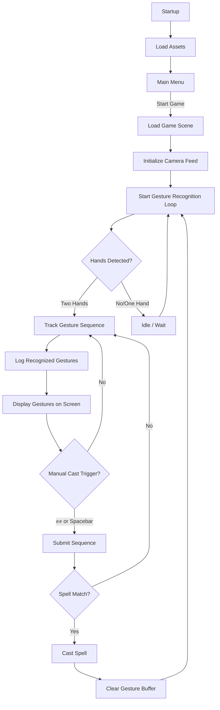
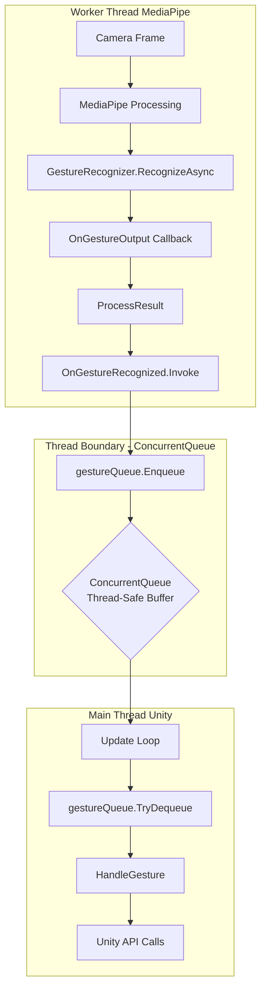
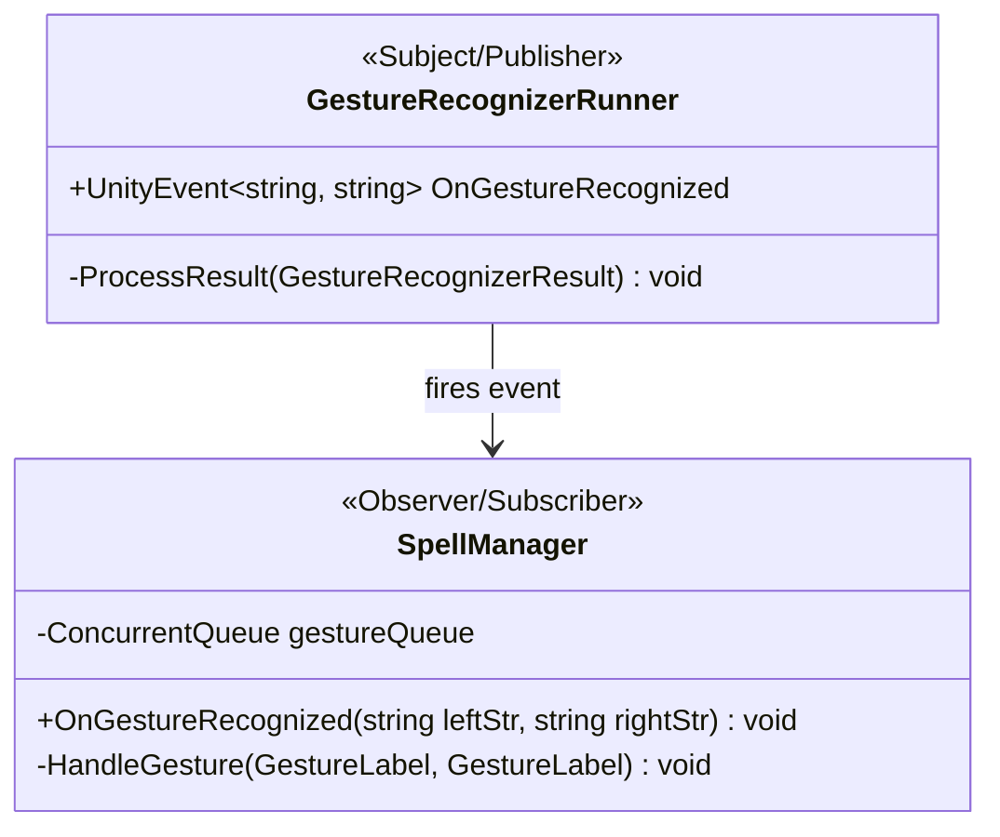

# Wizards Game
## Technical Architecture Overview

A deep dive into the system design and implementation

---

## System Overview

A Unity-based gesture recognition game integrating:
- **MediaPipe** for hand gesture recognition
- **Observer Pattern** for event-driven architecture
- **Strategy Pattern** for spell behaviors
- **Multi-threading** for performance optimization

**Tech Stack:** Unity, C#, MediaPipe, ScriptableObjects

---

## High-Level Architecture

The system follows clean separation of concerns:

1. **Data Layer** - Spell & SpellBook ScriptableObjects
2. **Behavior Layer** - SpellBehavior strategy implementations
3. **Execution Layer** - SpellCaster, AISpellManager
4. **Input Layer** - SpellManager, GestureRecognizerRunner
5. **UI Layer** - GestureUI, GestureUIBuffer, EnemyGestureDisplay

---

## Game Flow Diagram



---

## Threading Architecture


**Key Challenge:** MediaPipe runs on worker thread, Unity API requires main thread

---

## Threading Solution



---

## Observer Pattern Implementation



**Line 278:** `OnGestureRecognized?.Invoke(leftGesture, rightGesture)`
**Line 43:** `public void OnGestureRecognized(string leftStr, string rightStr)`

---

## Manual Cast Flow


---

## Core Spell System (Strategy Pattern)


**Benefits:**
- Easy to add new spell types without modifying existing code
- Each spell behavior is isolated and testable
- Runtime behavior switching possible

---

## Strategy Pattern Deep Dive

**Location:** `Spell.cs` holds a `SpellBehavior` reference

Different behaviors implement different casting logic:
- ProjectileBehavior
- ShieldBehavior
- HealBehavior
- AOEBehavior

Each behavior encapsulates its own logic while sharing the common interface.

---

## Spell Casting System


---

## Gesture Recognition System


**Components:**
- MediaPipeCamera (External System)
- GestureRecognizerRunner (Publisher)
- GestureMapper (String → Enum adapter)
- SpellManager (Subscriber)

---

## UI Components Architecture


**Key UI Elements:**
- GestureUI - Current gesture display
- GestureUIBuffer - Bottom-left combo display
- EnemyGestureDisplay - Shows AI casting
- Health/Mana bars (in progress)

---

## Combat & Projectile System


**Key Classes:**
- ProjectileBase - Base projectile behavior
- SpellCaster - Facade for spell casting
- AISpellManager - AI opponent logic

---

## Overall System Architecture


---

## Strategy Pattern ⭐


**Core Design Pattern** enabling flexible spell behaviors

---

## Observer Pattern


Decouples gesture recognition from spell casting logic

---

## Observer Pattern - Detailed Flow


Sequence diagram showing the complete event flow from gesture detection to spell execution

---

## Facade Pattern

`SpellCaster` acts as a facade, providing a simplified interface to the complex spell-casting subsystem:


**Benefits:**
- Simplified API for clients
- Hides internal complexity
- Centralized spell casting logic

---

## Adapter Pattern


**GestureMapper** adapts MediaPipe strings to internal enums

**Example:**
```csharp
string "Closed_Fist" → GestureLabel.ClosedFist
string "Thumb_Up" → GestureLabel.ThumbUp
```

---

## Flyweight Pattern


**ScriptableObjects** share data across multiple instances

**Benefits:**
- Memory efficient
- Shared spell data
- Easy to modify in Unity Inspector

---

## Component Pattern (Unity)

Multiple components attached to same GameObject communicate via `GetComponent<T>()`:

- SpellCaster ↔ Animator
- SpellCaster ↔ ShieldComponent
- ProjectileBase ↔ Rigidbody
- AISpellManager2 requires SpellCaster

**Unity Best Practice:** Composition over inheritance

---

## Manager/Service Pattern

**Central orchestration points:**

- **SpellManager** - Orchestrates gesture input → spell casting
- **AISpellManager/AISpellManager2** - Orchestrate AI spell casting
- **CameraEffects** - Provides camera shake service

**Benefits:** Centralized control, easy debugging, clear responsibilities

---

## Key Code Metrics

**Sprint 1 Results:**
- Total Lines of Code: **2,865** (individual contribution)
- Full project: **195,419** lines
- Features completed: **4**
- Requirements completed: **15**
- Burndown rate: **100%**

---

## Design Patterns Summary

1. **Strategy Pattern** ⭐ - Core spell behavior system
2. **Observer Pattern** - Event-driven gesture recognition
3. **Facade Pattern** - SpellCaster simplified interface
4. **Adapter Pattern** - GestureMapper string conversion
5. **Flyweight Pattern** - ScriptableObject data sharing
6. **Component Pattern** - Unity GameObject composition
7. **Manager/Service Pattern** - Centralized orchestration

---

## Technical Challenges Solved

**Thread Safety Issue:**
- MediaPipe runs on worker thread
- Unity API requires main thread
- **Solution:** ConcurrentQueue + Update loop dequeue

**Gesture Recognition Accuracy:**
- MediaPipe string output → internal enum
- **Solution:** GestureMapper adapter pattern

**Spell System Extensibility:**
- Need to add spells without modifying core code
- **Solution:** Strategy pattern with SpellBehavior

---

## Future Technical Improvements

**Sprint 2 Goals:**
1. Health & Mana resource management system
2. Improved collision detection
3. AI decision-making algorithm refinement
4. Performance optimization
5. Additional spell behaviors

---

## Architecture Takeaways

✅ **Clean separation of concerns** across 5 layers
✅ **Event-driven architecture** for loose coupling
✅ **Design patterns** for maintainability and extensibility
✅ **Thread-safe** gesture recognition integration
✅ **Scalable** spell system using Strategy pattern

**Result:** Maintainable, extensible, performant architecture

---

## Resources

- **Demo:** [Download Windows Demo](https://drive.google.com/file/d/1dMynKtngsOCwr-KwRBChzfMUlerCgxel/view?usp=drive_link)
- **Documentation:** See README.md
- **Spell Reference:** See user_spell_list.md

---

## Questions?

Thank you for exploring the Wizards Game architecture!


