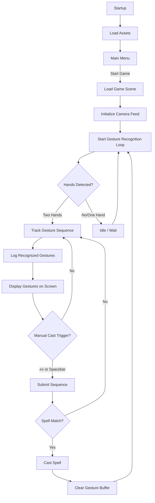
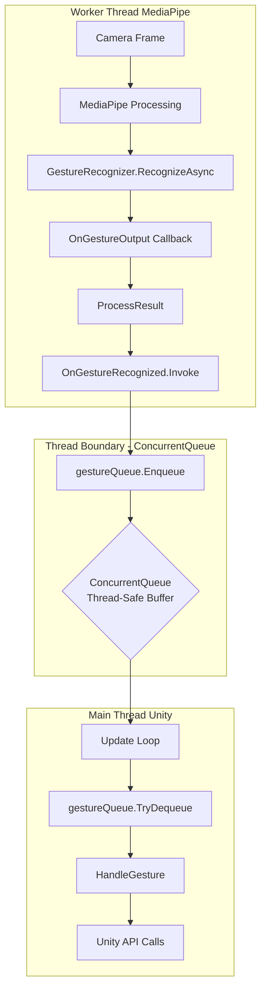

# System Architecture

## Overview

Wizards Game is built with a clean, maintainable architecture following best practices and established design patterns.

## High-Level Architecture

The system follows clean separation of concerns across five distinct layers:

1. **Data Layer** - Spell & SpellBook ScriptableObjects
2. **Behavior Layer** - SpellBehavior strategy implementations
3. **Execution Layer** - SpellCaster, AISpellManager
4. **Input Layer** - SpellManager, GestureRecognizerRunner
5. **UI Layer** - GestureUI, GestureUIBuffer, EnemyGestureDisplay

## Game Flow

The complete game flow from startup to spell casting:



## Manual Cast Flow


## System Components

### 1. Core Spell System (Strategy Pattern)


The spell system uses the Strategy Pattern for maximum flexibility and extensibility.

**Benefits:**
- Easy to add new spell types without modifying existing code
- Each spell behavior is isolated and testable
- Runtime behavior switching possible

### 2. Spell Casting System


The `SpellCaster` component acts as a facade, providing a simplified interface to the complex spell-casting subsystem.

### 3. Gesture Recognition System


**Key Components:**
- **MediaPipeCamera** - External system for hand detection
- **GestureRecognizerRunner** - Publisher in Observer pattern
- **GestureMapper** - Adapter converting strings to enums
- **SpellManager** - Subscriber handling gesture events

### 4. UI Components


**Key UI Elements:**
- GestureUI - Current gesture display
- GestureUIBuffer - Bottom-left combo display
- EnemyGestureDisplay - Shows AI casting
- Health/Mana bars

### 5. Combat & Projectile System


**Key Classes:**
- ProjectileBase - Base projectile behavior
- SpellCaster - Facade for spell casting
- AISpellManager - AI opponent logic

### 6. Overall System Architecture


## Design Patterns

### Strategy Pattern ⭐ (Core Pattern)


**Location:** `Spell.cs` holds a `SpellBehavior` reference

Different behaviors implement different casting logic:
- ProjectileBehavior
- ShieldBehavior
- HealBehavior
- AOEBehavior

Each behavior encapsulates its own logic while sharing the common interface.

### Observer Pattern


Decouples gesture recognition from spell casting logic.

#### Detailed Observer Flow


Sequence diagram showing the complete event flow from gesture detection to spell execution.

### Facade Pattern


`SpellCaster` acts as a facade, providing a simplified interface to the complex spell-casting subsystem.

**Benefits:**
- Simplified API for clients
- Hides internal complexity
- Centralized spell casting logic

### Adapter Pattern


**GestureMapper** adapts MediaPipe strings to internal enums.

**Example:**
```csharp
string "Closed_Fist" → GestureLabel.ClosedFist
string "Thumb_Up" → GestureLabel.ThumbUp
```

### Flyweight Pattern


**ScriptableObjects** share data across multiple instances.

**Benefits:**
- Memory efficient
- Shared spell data
- Easy to modify in Unity Inspector

### Component Pattern (Unity)

Multiple components attached to same GameObject communicate via `GetComponent<T>()`:

- SpellCaster ↔ Animator
- SpellCaster ↔ ShieldComponent
- ProjectileBase ↔ Rigidbody
- AISpellManager2 requires SpellCaster

**Unity Best Practice:** Composition over inheritance

### Manager/Service Pattern

**Central orchestration points:**

- **SpellManager** - Orchestrates gesture input → spell casting
- **AISpellManager/AISpellManager2** - Orchestrate AI spell casting
- **CameraEffects** - Provides camera shake service

**Benefits:** Centralized control, easy debugging, clear responsibilities

## Threading Architecture


**Key Challenge:** MediaPipe runs on worker thread, Unity API requires main thread

**Solution:** ConcurrentQueue pattern for thread-safe gesture data transfer



## Architecture Summary

✅ **Clean separation of concerns** across 5 layers  
✅ **Event-driven architecture** for loose coupling  
✅ **Design patterns** for maintainability and extensibility  
✅ **Thread-safe** gesture recognition integration  
✅ **Scalable** spell system using Strategy pattern

**Result:** Maintainable, extensible, performant architecture

## Learn More

- [Technical Implementation Details](/technical/)
- [Gameplay Tutorial](/gameplay/)
- [GitHub Repository](https://github.com/joseph-ampfer/ninja_wizards_hands)

