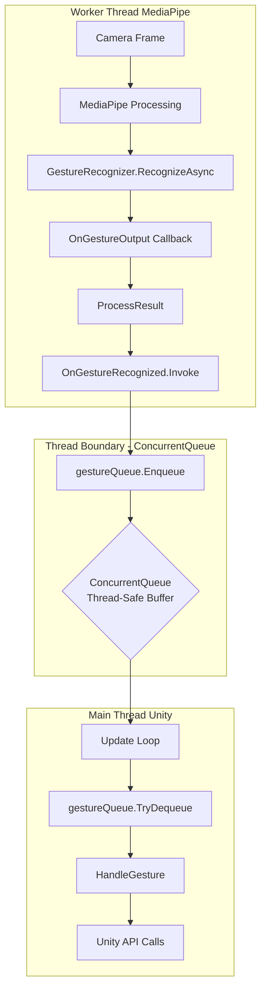
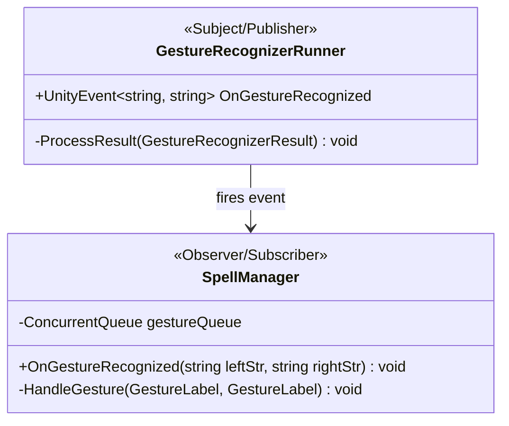

# Technical Overview

A deep dive into the implementation details and technical decisions behind Wizards Game.

## System Overview

A Unity-based gesture recognition game integrating:
- **MediaPipe** for hand gesture recognition
- **Observer Pattern** for event-driven architecture
- **Strategy Pattern** for spell behaviors
- **Multi-threading** for performance optimization

**Tech Stack:** Unity, C#, MediaPipe, ScriptableObjects

## Threading Architecture

**Key Challenge:** MediaPipe runs on worker thread, Unity API requires main thread


### Threading Solution

The system uses a **ConcurrentQueue** as a thread-safe buffer between MediaPipe's worker thread and Unity's main thread.



### Implementation Details

**Worker Thread (MediaPipe):**
- Camera frames processed asynchronously
- Gesture recognition happens off the main thread
- Results enqueued to ConcurrentQueue

**Main Thread (Unity):**
- Update loop dequeues gestures
- Processes gestures and updates UI
- Invokes Unity API calls safely

## Observer Pattern Implementation



**Key Lines:**
- **Line 278:** `OnGestureRecognized?.Invoke(leftGesture, rightGesture)`
- **Line 43:** `public void OnGestureRecognized(string leftStr, string rightStr)`

Connected via Unity Inspector for loose coupling.

## Strategy Pattern Deep Dive

**Location:** `Spell.cs` holds a `SpellBehavior` reference

Different behaviors implement different casting logic:
- **ProjectileBehavior** - Launches projectiles
- **ShieldBehavior** - Creates defensive barriers
- **HealBehavior** - Restores health
- **AOEBehavior** - Area-of-effect damage

Each behavior encapsulates its own logic while sharing the common interface.

**Benefits:**
- Easy to add new spell types without modifying existing code
- Each spell behavior is isolated and testable
- Runtime behavior switching possible

## Adapter Pattern

**GestureMapper** adapts MediaPipe strings to internal enums.

**Example:**
```csharp
public static GestureLabel ToEnum(string gestureString)
{
    switch (gestureString)
    {
        case "Closed_Fist": return GestureLabel.ClosedFist;
        case "Thumb_Up": return GestureLabel.ThumbUp;
        case "Victory": return GestureLabel.Victory;
        // ... more mappings
    }
}
```

This decouples the external MediaPipe API from internal game logic.

## Flyweight Pattern

**ScriptableObjects** share data across multiple instances.

```csharp
[CreateAssetMenu(fileName = "New Spell", menuName = "Spells/Spell")]
public class Spell : ScriptableObject
{
    public string spellName;
    public int manaCost;
    public float castTime;
    public SpellBehavior behavior;
}
```

**Benefits:**
- Memory efficient - one instance shared by all references
- Easy to modify in Unity Inspector
- Data-driven design

## Facade Pattern

`SpellCaster` acts as a facade, providing a simplified interface:

```csharp
public class SpellCaster : MonoBehaviour
{
    public void Cast(Spell spell)
    {
        // Simplified interface hides complexity:
        // - Mana checking
        // - Animation triggering
        // - Behavior execution
        // - Cooldown management
    }
}
```

**Benefits:**
- Simplified API for clients
- Hides internal complexity
- Centralized spell casting logic

## Key Code Metrics

**Sprint 1 Results:**
- Total Lines of Code: **2,865** (individual contribution)
- Full project: **195,419** lines
- Features completed: **4**
- Requirements completed: **15**
- Burndown rate: **100%**

## Design Patterns Summary

1. **Strategy Pattern** ⭐ - Core spell behavior system
2. **Observer Pattern** - Event-driven gesture recognition
3. **Facade Pattern** - SpellCaster simplified interface
4. **Adapter Pattern** - GestureMapper string conversion
5. **Flyweight Pattern** - ScriptableObject data sharing
6. **Component Pattern** - Unity GameObject composition
7. **Manager/Service Pattern** - Centralized orchestration

## Technical Challenges Solved

### Thread Safety Issue
- **Problem:** MediaPipe runs on worker thread, Unity API requires main thread
- **Solution:** ConcurrentQueue + Update loop dequeue pattern

### Gesture Recognition Accuracy
- **Problem:** MediaPipe string output needs conversion to internal enums
- **Solution:** GestureMapper adapter pattern for decoupling

### Spell System Extensibility
- **Problem:** Need to add spells without modifying core code
- **Solution:** Strategy pattern with SpellBehavior interface

## Performance Optimizations

1. **Object Pooling** - Reuse projectiles and particle effects
2. **Async Processing** - MediaPipe runs off main thread
3. **ScriptableObjects** - Shared data reduces memory footprint
4. **Event-Driven Updates** - Only process when gestures change

## Testing Strategy

**Test Coverage:**
- Unit tests for gesture mapping
- Unit tests for spell behaviors
- Integration tests for spell casting flow
- Mock objects for external dependencies

**Test Files:**
- `GestureMapperTests.cs`
- `SpellCasterTests.cs`
- `ProjectileBaseTests.cs`
- `IntegrationTestExample.cs`

## Future Technical Improvements

**Sprint 2 Goals:**
1. Health & Mana resource management system
2. Improved collision detection
3. AI decision-making algorithm refinement
4. Performance optimization
5. Additional spell behaviors

## Architecture Takeaways

✅ **Clean separation of concerns** across 5 layers  
✅ **Event-driven architecture** for loose coupling  
✅ **Design patterns** for maintainability and extensibility  
✅ **Thread-safe** gesture recognition integration  
✅ **Scalable** spell system using Strategy pattern

**Result:** Maintainable, extensible, performant architecture

## Resources

- [System Architecture](/architecture/)
- [Gameplay Tutorial](/gameplay/)
- [GitHub Repository](https://github.com/joseph-ampfer/ninja_wizards_hands)
- [Download Demo](/download/)

